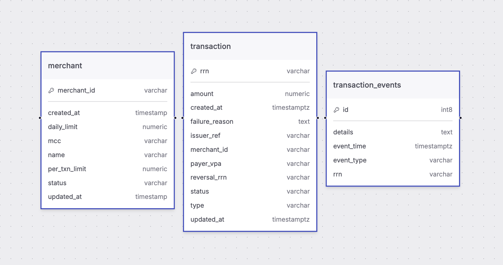
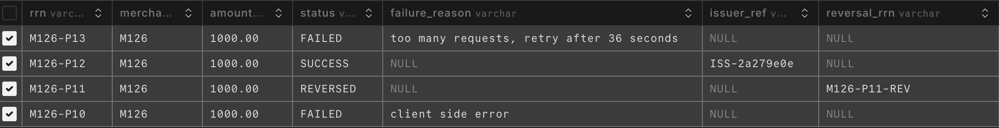
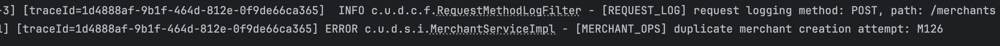

# Mini UPI Acquirer Switch (Spring WebFlux + PostgreSQL)

## Description

This is a **mini NPCI-style UPI Acquirer Switch** backend application. It simulates how an acquiring bank or BAPA platform processes UPI transactions. The system:

- Accepts UPI **Collect** and **Pay** requests from a PSP.
- Applies acquirer-side validations (merchant status, limits, velocity, idempotency).
- Routes requests to a **mock Issuer Bank**.
- Handles **issuer timeouts** and reversals safely.
- Maintains a **full audit trail** of all transaction state changes.
- **Tech Stack:** Java 17+, Spring Boot WebFlux, PostgreSQL, R2DBC, BigDecimal for money fields.

---

## Getting Started (Local Development)

### Prerequisites
- Java 17+
- PostgreSQL
- Maven
- IDE (IntelliJ, VSCode, etc.)

### Application Configuration
- Application Properties
```
spring.r2dbc.url: ${DB_URL}
spring.r2dbc.username: ${DB_USERNAME}
spring.r2dbc.password: ${DB_PASSWORD}
```

- Example Environment Variables
```
DB_URL= r2dbc:postgresql://localhost:5432/upi_switch
DB_USERNAME= postgres
DB_PASSWORD= postgres
```

### Running The Application
- Using Maven
`mvn clean spring-boot:run
`
- Once the application starts, it will listen on **port 8080** by default.

## Database Schema & Migrations

The application uses **PostgreSQL** with three main tables: `merchant`, `transactions`, and `transaction_events`. Below are the DDL statements and indexes used.

### Merchant Table

```sql
    CREATE TABLE merchant (
        id BIGSERIAL PRIMARY KEY,
        merchant_id VARCHAR NOT NULL UNIQUE,
        name VARCHAR NOT NULL,
        mcc VARCHAR NOT NULL,
        status VARCHAR NOT NULL,
        daily_limit NUMERIC(18,2) NOT NULL,
        per_txn_limit NUMERIC(18,2) NOT NULL,
        created_at TIMESTAMP NOT NULL,
        updated_at TIMESTAMP NOT NULL
    );
```

### Transactions Table

```sql
    CREATE TABLE transactions (
        id BIGSERIAL PRIMARY KEY,
        rrn VARCHAR NOT NULL UNIQUE,
        type VARCHAR NOT NULL,
        merchant_id VARCHAR NOT NULL,
        payer_vpa VARCHAR NOT NULL,
        amount NUMERIC(18,2) NOT NULL CHECK (amount > 0),
        status VARCHAR NOT NULL,
        failure_reason VARCHAR,
        issuer_ref VARCHAR,
        reversal_rrn VARCHAR UNIQUE,
        created_at TIMESTAMP NOT NULL,
        updated_at TIMESTAMP NOT NULL
    );
```

### Transaction Events Table

```sql
    CREATE TABLE transaction_events (
        id BIGSERIAL PRIMARY KEY,
        rrn VARCHAR NOT NULL,
        event_type VARCHAR NOT NULL,
        event_time TIMESTAMP NOT NULL,
        details VARCHAR
    );
```


### Indexes

```sql
    CREATE INDEX idx_transaction_merchant_id ON transactions (merchant_id);
    CREATE INDEX idx_transaction_reversal_rrn ON transactions (reversal_rrn);
    CREATE INDEX idx_transaction_merchant_created ON transactions (merchant_id, created_at);
    CREATE INDEX idx_transaction_merchant_status_created ON transactions (merchant_id, status, created_at);
    CREATE INDEX idx_transaction_amount ON transactions (amount);
    CREATE INDEX idx_event_rrn_time ON transaction_events (rrn, event_time);
```

### Schema Diagram


## APIs

### Merchant Creation
```
curl --location 'http://localhost:8080/merchants' \
--header 'Content-Type: application/json' \
--data '{
    "merchantId": "M126",
    "name": "Amazon Store",
    "mcc": "5311",
    "status": "ACTIVE",
    "dailyLimit": 5000.00,
    "perTxnLimit": 1000.00
}'
```

### UPI Collect
```
curl --location 'http://localhost:8080/upi/collect' \
--header 'Content-Type: application/json' \
--data-raw '{
  "rrn": "123456789013",
  "payerVpa": "raj@upi",
  "merchantId": "M124",
  "amount": "750.00",
  "note": "Subscription payment"
}'
```

### UPI Pay
```
curl --location 'http://localhost:8080/upi/pay' \
--header 'Content-Type: application/json' \
--data-raw '{
  "rrn": "M126-P13",
  "payerVpa": "raj@upi",
  "merchantId": "M126",
  "amount": "1000.00",
  "note": "Order#7781"
}'
```

### UPI Reversal
```
curl --location 'http://localhost:8080/upi/reversal' \
--header 'Content-Type: application/json' \
--data '{
  "originalRrn": "M126-P11",
  "reversalRrn": "M126-P11-REV2",
  "reason": "customer dispute"
}'
```

### Get Transaction
```
curl --location 'http://localhost:8080/upi/transactions/M123-P24'
```

## Postman Collection
[upi-switch.postman_collection.json](src/main/resources/upi-switch.postman_collection.json)

## Error Handling

The application uses standard HTTP status codes and structured responses to indicate errors and validation failures. All errors include a **reason code** and a **message** for easier debugging and traceability.

### HTTP Status Codes

| Status Code | Meaning | When Used |
|-------------|---------|-----------|
| 400         | Bad Request | Validation errors (e.g., missing fields, negative amounts) |
| 404         | Not Found | Merchant or transaction not found |
| 409         | Conflict | Duplicate RRN or invalid state transition |
| 400         | Too Many Requests | Velocity / rate limit exceeded |

## Validations

The application performs **acquirer-side validations** to ensure safety, correctness, and compliance with merchant limits and rules. These validations are handled in the `ValidationServiceImpl` service.

### 1. Duplicate RRN Handling (Idempotency)

- Each transaction has a unique `rrn` (Reference Number).
- If a transaction with the same `rrn` is received again:
    - Do **not** create a new transaction.
    - Return the existing transaction response.
- This ensures **idempotent behavior**.

### 2. Merchant Validation

- Merchant must **exist** in the system.
- Merchant must have **status = ACTIVE**.
- If merchant is inactive or not found, the transaction is rejected with the appropriate failure reason.

### 3. Per Transaction Limit

- The transaction amount is compared against the merchant's `perTxnLimit`.
- If the transaction exceeds this limit, it is rejected.

### 4. Daily Limit

- The system calculates the sum of all **successful transactions for the merchant today**.
- If the current transaction would cause the daily total to exceed the merchant's `dailyLimit`, the transaction is rejected.

### 5. Rate Limiting / Velocity

- Maximum **20 requests per merchant in a rolling 60 seconds**.
- If the limit is exceeded, the transaction is rejected with a **retry-after** time.

### 6. Transaction Validation Flow

The validation flow is implemented in `ValidationServiceImpl.validate()`:

1. Check if the transaction already exists (`existsByRrn`).
2. If not, fetch the merchant by `merchantId`.
3. Validate against merchant rules:
    - Status check
    - Per transaction limit
    - Daily limit
    - Rate limiting
4. Return a `TransactionValidationResultDTO` indicating **success** or **failure**, along with a **reason code** and message.

---

### Failure Reason Codes

| Code                          | Description                                           |
|-------------------------------|-------------------------------------------------------|
| `MERCHANT_NOT_FOUND`           | Merchant does not exist                               |
| `MERCHANT_INACTIVE`            | Merchant is inactive                                  |
| `PER_TXN_LIMIT_EXCEEDED`       | Transaction amount exceeds per-transaction limit     |
| `DAILY_LIMIT_EXCEEDED`         | Transaction would exceed merchant's daily limit      |
| `RATE_LIMIT_EXCEEDED`          | Too many requests in a short period (velocity limit) |

---

### DB Screenshot Of Flows For Few Transactions



## Logging & Traceability

To ensure observability and traceability of UPI transactions, the application uses **MDC (Mapped Diagnostic Context)** along with **Reactor Context** for reactive trace propagation.

### 1. Trace ID Propagation

- Every request is assigned a **unique `traceId`**.
- This `traceId` is stored in the **MDC** and automatically included in all logs related to the request.
- Using **Reactor Context**, the `traceId` is propagated across reactive chains (Mono/Flux) even in asynchronous and non-blocking flows.

### 2. Implementation

- `traceId` is generated at the entry point (e.g., in a WebFlux filter or controller advice).
- Reactor context is updated with the `traceId`:
  ```java
  Mono.deferContextual(ctx -> {
      String traceId = ctx.getOrDefault("traceId", UUID.randomUUID().toString());
      MDC.put("traceId", traceId);
      return someMonoOperation()
             .doFinally(signalType -> MDC.clear());
  }).contextWrite(Context.of("traceId", traceId));
  
### Screenshot of Logs


## Assumptions
- issuer ref generation hardcoded as the issuer for a mock service. 
- introduction of an extra field/column in the transactions table named as `reversal_rrn` for storing the reversal rrn of the transactions in case of reversal.
